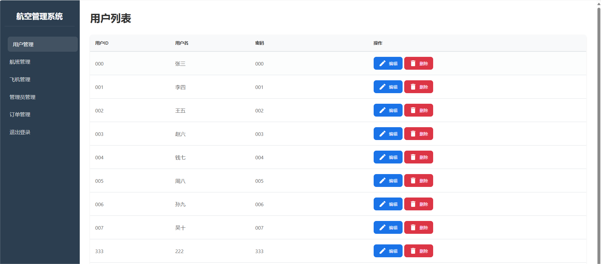
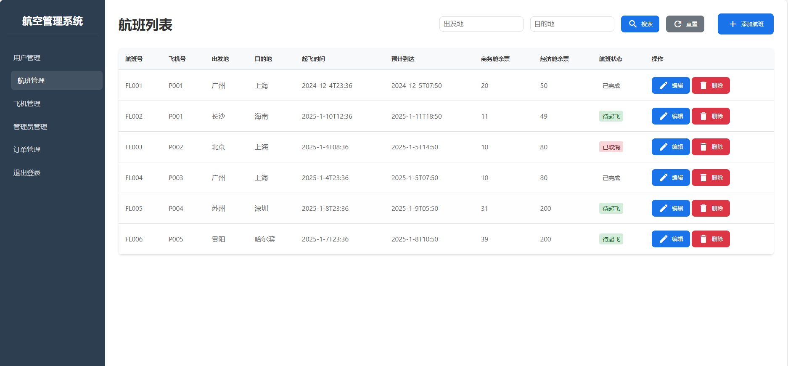
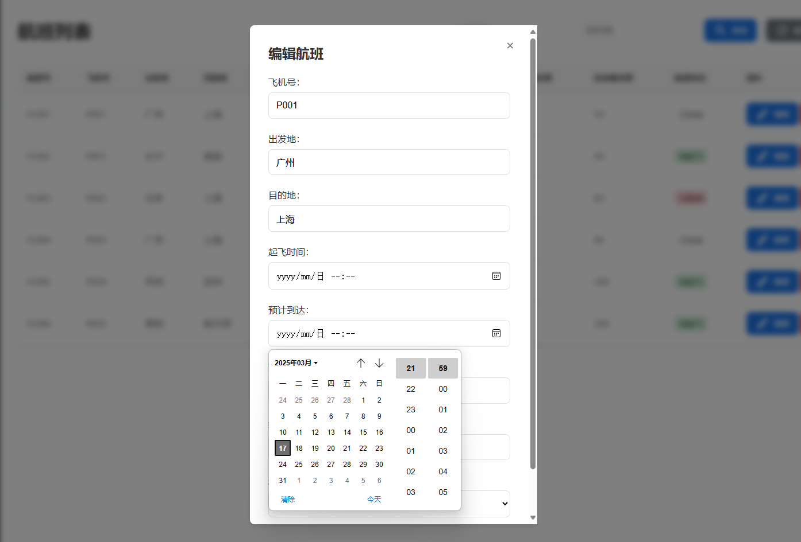
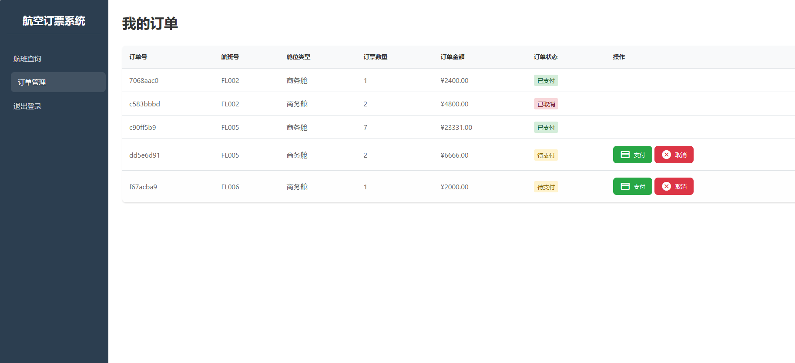

# Flask+SQLAlchemy+MySQL的一个小项目

一个简易的航空票务系统

##  一、效果演示

**登录界面**


**注册界面**


**管理员页面部分展示**







**用户页面部分展示**



##  二、具体安装

具体依赖安装：

```
pip install -r requirements.txt
```

##  三、使用说明

1. 需要先修改env.py文件的Config类，这里使用的是Mysql，一般只需要修改USERNAME、PASSWORD、DB就可以了

2. 本地的Mysql需要自己先创建ORM映射表所对应的实体表，代码如下：

   ```
   -- 创建 Users 表
   CREATE TABLE Users (
       UserID VARCHAR(255) PRIMARY KEY COMMENT '用户id',
       Name VARCHAR(255) NOT NULL COMMENT '昵称',
       Passwd VARCHAR(255) NOT NULL COMMENT '密码'
   ) COMMENT='用户表';
   
   -- 创建 Admins 表
   CREATE TABLE Admins (
       AdminID VARCHAR(255) PRIMARY KEY COMMENT '管理员id',
       Name VARCHAR(255) NOT NULL COMMENT '昵称',
       Passwd VARCHAR(255) NOT NULL COMMENT '密码',
       Role ENUM('ToAdmins', 'ToFlights', 'ToPlanes', 'ToUsers') NOT NULL COMMENT '角色'
   ) COMMENT='管理员表';
   
   -- 创建 Planes 表
   CREATE TABLE Planes (
       PlaneID VARCHAR(255) PRIMARY KEY COMMENT '飞机id',
       BCnum INT NOT NULL COMMENT '商务舱座位数量',
       BCprice DECIMAL(7, 2) NOT NULL COMMENT '商务舱价格',
       ECnum INT NOT NULL COMMENT '经济舱座位数量',
       ECprice DECIMAL(7, 2) NOT NULL COMMENT '经济舱价格',
       PStatus ENUM('待命', '飞行中', '维护中') NOT NULL COMMENT '飞机状态'
   ) COMMENT='飞机表';
   
   -- 创建 Flights 表
   CREATE TABLE Flights (
       FlightID VARCHAR(255) PRIMARY KEY COMMENT '航班id',
       PlaneID VARCHAR(255) NOT NULL COMMENT '飞机id',
       Origin VARCHAR(255) NOT NULL COMMENT '出发地',
       Destin VARCHAR(255) NOT NULL COMMENT '目的地',
       STime VARCHAR(255) NOT NULL COMMENT '起飞时间',
       PEtime VARCHAR(255) NOT NULL COMMENT '预计到达时间',
       BCfree INT NOT NULL COMMENT '商务舱座位剩余数',
       ECfree INT NOT NULL COMMENT '经济舱座位剩余数',
       FStatus ENUM('待起飞', '飞行中', '已取消', '已延误', '已完成') NOT NULL COMMENT '航班状态',
       FOREIGN KEY (PlaneID) REFERENCES Planes(PlaneID)
   ) COMMENT='航班表';
   
   -- 创建 Orders 表
   CREATE TABLE Orders (
       OrderID VARCHAR(255) PRIMARY KEY COMMENT '订单id',
       UserID VARCHAR(255) NOT NULL COMMENT '用户id',
       FlightID VARCHAR(255) NOT NULL COMMENT '航班id',
       Accom ENUM('经济舱', '商务舱') NOT NULL COMMENT '舱位品类',
       OrderNum INT NOT NULL COMMENT '订单数量',
       OrderPrice DECIMAL(7, 2) NOT NULL COMMENT '订单总价',
       OStatus ENUM('待支付', '已支付', '已取消') NOT NULL COMMENT '订单状态',
       FOREIGN KEY (UserID) REFERENCES Users(UserID),
       FOREIGN KEY (FlightID) REFERENCES Flights(FlightID)
   ) COMMENT='订单表';
   ```

   如果你创建时遇到外键检查导致无法创建，可以先禁用外键检查而后再开启

   ```
   SET GLOBAL FOREIGN_KEY_CHECKS=0;
   # 搞定了在开启
   SET GLOBAL FOREIGN_KEY_CHECKS=1;
   ```

3. 本地运行文件：运行app.py文件，就可以在本机上使用该网站

4. 如果需要局域网内使用：运行run.py文件，就可以在局域网内使用（未使用nginx代理）


##  四、目录注解

```
D:.
│   .gitignore	# git的忽略文件
│   app.py		# 本地运行启动文件			
│   env.py		# 应用配置文件
│   models.py	# ORM映射表文件
│   README.md
│   requirements.txt
│   run.py		# 局域网启动文件
│   views.py	# 视图函数文件
│
├───pictures	# README文件图片存放处
│       01.png
│       02.png
│       03.png
│       04.png
│       05.png
│       06.png
│
├───static			# 网页静态文件
│   │   login.css
│   │   main.css
│   │   main.js
│   │
│   └───images		# 登录页面和注册页面的背景图片 
│           login.jpg
│
├───templates				# 网页前端文件
│       admin_index.html
│       admin_manage.html
│       flight_manage.html
│       login.html
│       order_manage.html
│       plane_manage.html
│       private_order.html
│       register.html
│       user_index.html
│
├───view
└───__pycache__
        app.cpython-39.pyc
        env.cpython-39.pyc
        models.cpython-39.pyc
        view.cpython-39.pyc
        views.cpython-39.pyc
```

